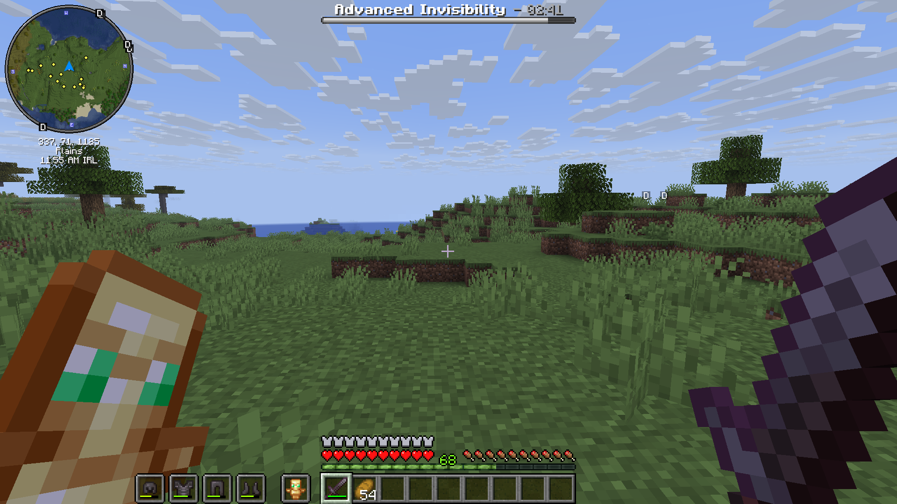
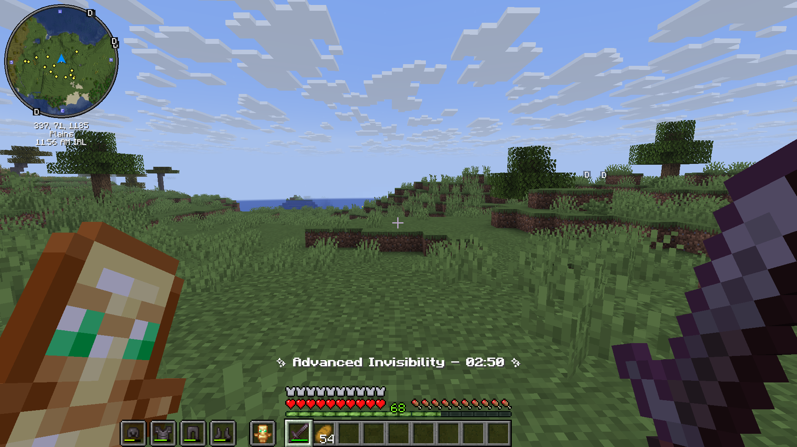
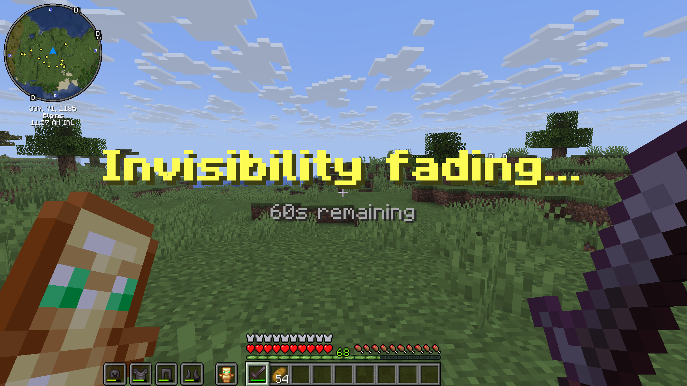

# Advanced Invisibility


A feature-rich Minecraft plugin for **Paper 1.21+** that grants players true, server-side invisibility — far beyond the vanilla Invisibility potion. Built with ProtocolLib for deep packet-level control.

## Features

- **True invisibility** — Players are completely hidden from other players at the packet level using ProtocolLib. No armor, no held items, no hitbox collision.
- **Tab list preserved** — Invisible players remain visible in the Tab List via re-injected `PLAYER_INFO` packets.
- **Economy integration** — Integrates with Vault for per-minute pricing.
- **Effect persistence** — If an invisible player disconnects, their remaining time and boss bar progress are saved to disk. When they rejoin, the effect resumes from exactly where it left off.
- **Mob stealth system** — Mobs completely ignore invisible players. If a player attacks a mob, their stealth is broken and mobs will aggro them. Drinking an **Awkward Potion** fully restores stealth, including dropping existing mob aggro.
- **Configurable display** — Choose between `BOSS_BAR`, `ACTION_BAR`, or `NONE` for the timer UI. Dynamically reloads mid-effect via `/advanceinv reload`.
- **Sound suppression** — Suppresses armour equip sounds, hurt sounds, eating/drinking sounds comming from invisible players.

## Requirements

| Dependency | Version | Required? |
|---|---|---|
| [Paper](https://papermc.io) | 1.21+ | Required |
| [ProtocolLib](https://www.spigotmc.org/resources/protocollib.1997/) | 5.4.0+ | Required |
| [Vault](https://www.spigotmc.org/resources/vault.34315/) | 1.7+ | Required |
| An economy plugin (e.g. EssentialsX) | Any | Required |

## Installation

1. Drop `AdvancedInvisibility-1.0.0.jar` into your server's `plugins/` folder.
2. Install **ProtocolLib** and **Vault** (plus an economy plugin).
3. Restart your server.
4. Edit `plugins/AdvancedInvisibility/config.yml` to your liking.

## Configuration

```yaml
advanced-invisibility:
  price-per-minute: 500.0   # Cost per minute. Set to 0 for free.
  default-time: 3            # Default duration in minutes if no time is specified.
  display-type: BOSS_BAR     # Timer UI: NONE | BOSS_BAR | ACTION_BAR
  disable-mob-detection: true # If true, mobs ignore invisible players.

messages:
  already-active: "§cYou already have the Advanced Invisibility effect active."
  not-enough-money: "§cYou don't have enough money. This effect costs $§e{price}§c."
  activated: "§aAdvanced Invisibility activated for §e{time} minute(s)§a for $§e{price}§a."
  admin-gave: "§aGave §e{player}§a advance invisibility for §e{time} minute(s)§a."
  admin-removed: "§aRemoved advance invisibility from §e{player}§a."
  removed: "§eYour invisibility effect has been removed."
  no-permission: "§cYou don't have permission to use this command."

warnings:
  thresholds: [60, 30, 10]   # Seconds remaining when a title warning fires
  expired-title: "§4Invisibility Lost"  # Title shown when the effect expires
  subtitle: "§7{time}s remaining"       # Subtitle shown at each warning. {time} = seconds left
  fade-in: 5    # Ticks to fade in
  stay: 60      # Ticks to stay on screen
  fade-out: 10  # Ticks to fade out
```

## Commands

### Player Commands
| Command | Description |
|---|---|
| `/advanceinv` | Purchase the effect for the default duration |
| `/advanceinv <minutes>` | Purchase the effect for a specific number of minutes |

### Admin Commands
| Command | Description |
|---|---|
| `/advanceinv <player>` | Give a player the effect for the default duration |
| `/advanceinv <player> <minutes>` | Give a player the effect for a specific duration |
| `/advanceinv <player> remove` | Remove the effect from a player immediately |
| `/advanceinv reload` | Reload the configuration |

## Permissions

| Permission | Description | Default |
|---|---|---|
| `advancedinvisibility.use` | Allows players to purchase the effect | `op` |
| `advancedinvisibility.admin` | Allows admin commands (give/remove/reload) | `op` |

## How the Stealth System Works

1. Player buys the effect — they become completely invisible to others.
2. Mobs will not detect or target the player (if `disable-mob-detection: true`).
3. If the player attacks a mob or player — their stealth is broken. Mobs begin targeting them normally.
4. Drinking an **Awkward Potion** — stealth is fully restored. Every mob that ever aggroed the player has their target dropped, regardless of distance.
5. Effect expires, player dies, or drinks milk — full cleanup.

## Screenshots

### Display Types

<table>
  <tr>
    <td><br>Boss Bar</td>
    <td><br>Acion Bar</td>
    <td><br>Warning message (for "NONE" display type)</td>
  </tr>
</table>

### Invisibility player POVs

<table>
  <tr>
    <td><br>POV of player having Advance Invisibility (third person camera)</td>
    <td><br>POV of other players</td>
  </tr>
</table>

> *Note: You can see your own armout and totems but others players wont be. Similarly you can hear sounds you generate, others wont be able to hear them.*

## Building from Source

Requires Java 17+ and Maven (or `mvnd` for faster builds).

```bash
git clone https://github.com/rxdwan/AdvanceInvisibilityPlugin.git
cd AdvanceInvisibilityPlugin
mvnd clean package
```

The compiled JAR will be in `target/AdvancedInvisibility-1.0.0.jar`.

## License

[](https://www.gnu.org/licenses/gpl-3.0)
